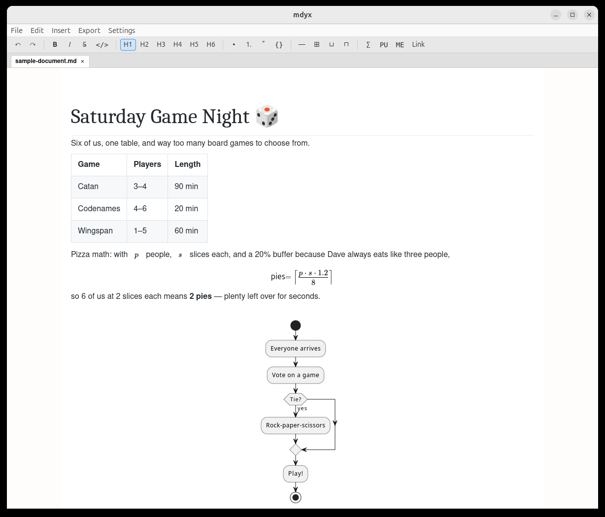
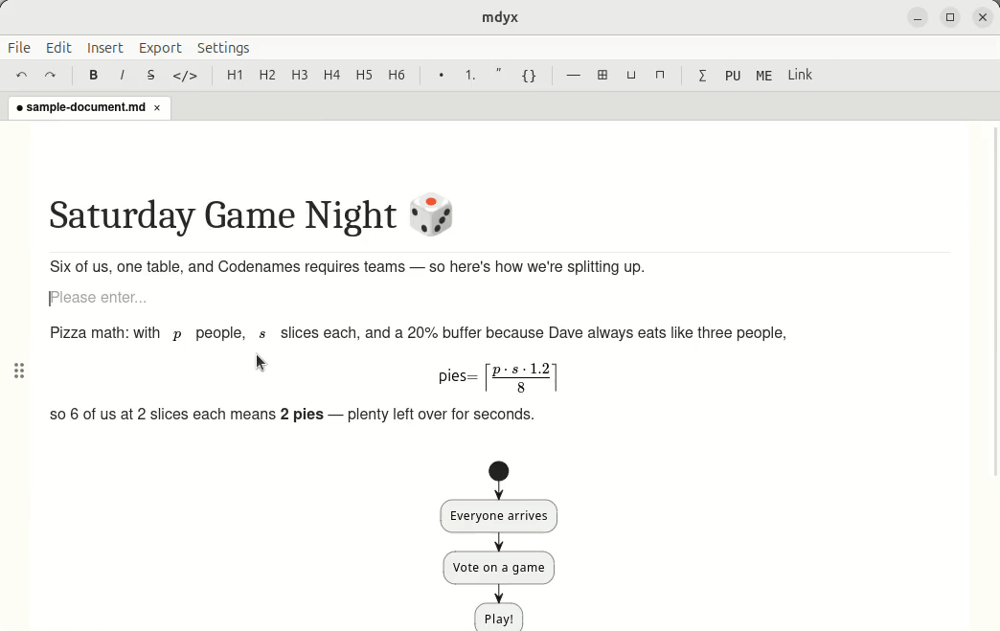
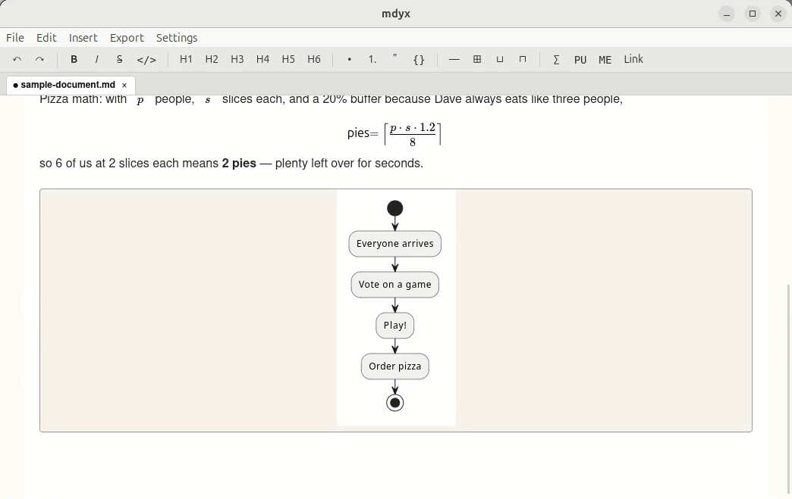

# MDyX

A LyX-style WYSIWYM Markdown editor.

MDyX lets you edit plain Markdown files with a WYSIWYM ("What You See Is What You Mean") interface in the spirit of [LyX](https://www.lyx.org/): an always-visible menu bar and formatting toolbar instead of raw Markdown syntax, while the file on disk stays plain, portable Markdown that any other editor or tool can open.



## Why MDyX?

- Good WYSIWYG-style Markdown editors turned out to be surprisingly hard to find.
- Markdown is great, but you shouldn't have to learn its syntax to get the benefit of it — the same way LyX lets you write LaTeX documents without writing LaTeX by hand.
- Complex tables and diagrams are best edited in a dedicated tool, not reinvented inside a text editor. MDyX leaves that work to external tools (a spreadsheet, a PlantUML editor, ...) and exchanges data with them through the clipboard, in both directions.

## Features

- Tabbed editing of multiple Markdown files, with your open tabs and window layout restored the next time you launch the app.
- Tables with merged cells, math formulas, and PlantUML/Mermaid diagrams, all edited visually — no Markdown syntax to type or memorize.
- Everything round-trips through the clipboard: copy a table into a spreadsheet and back, and it's still a table. Same for diagrams and images.
- Images are always referenced by path or URL, never embedded as binary data.
- The saved file is plain, ordinary Markdown, readable by any other tool.
- Export to a styled, standalone HTML file (or straight to PDF via your browser's Print dialog), with a theme you can customize — see [Export](#export) below for details.

## Usage

### Tables

- **Insert**: paste a table (from a spreadsheet, or Markdown pipe syntax) with nothing selected, or use Insert > Table.
- **Update**: select the table and paste a new one to replace it in place.
- **External tools**: copying a selected table writes both an HTML and a Markdown version to the clipboard, so it pastes back correctly into a spreadsheet app too — merged cells included.



### Images

- **Insert**: paste a file path or URL with nothing selected, or use Insert > Image (opens a dialog to type a path/URL or browse for a file, if the clipboard doesn't have a usable one).
- **Update**: select the image and paste a new path/URL to replace it.
- **External tools**: copying a selected image gives you back its file path, to hand off to another program.
- **Select the image itself** (click directly on it) before copying. Unlike tables/PlantUML/Mermaid, an image is an *inline* element — Markdown lets it sit inline with surrounding text — so it's always nested inside a paragraph. Clicking a block's drag handle (the grip icon in the left margin) selects that paragraph, not the image nested inside it, and copying a paragraph selection gives back its content, not the image's file path. This applies even when the paragraph contains nothing but the image.

### Math

- **Insert**: Insert > Math, or the toolbar's Σ button.
- **Update**: click into the formula and edit it in place with MathLive's own LaTeX-style symbol palette.
- **External tools**: not applicable — formulas are edited directly in MDyX.
- Two different math renderers are used on purpose: [MathLive](https://cortexjs.io/mathlive/) while editing, for its interactive symbol palette, and [KaTeX](https://katex.org/) for exported HTML, which just needs lightweight static output with no editor attached.

### PlantUML diagrams

- **Insert**: paste PlantUML source (`@startuml` ... `@enduml`, with or without a ` ```plantuml ` fence around it) with nothing selected, or use Insert > PlantUML Diagram.
- **Update**: select the diagram and paste new source to re-render it.
- **External tools**: copying a selected diagram gives back its PlantUML source, to edit in a dedicated PlantUML editor (e.g. [Blockly PlantUML Editor](https://github.com/patakuti/blockly-plantuml-editor)) and paste back in. Diagrams are rendered by a PlantUML server, configurable in Settings.



### Mermaid diagrams

- **Insert**: paste Mermaid source wrapped in a ` ```mermaid ` fenced code block with nothing selected, or use Insert > Mermaid Diagram. Unlike PlantUML, unfenced Mermaid text isn't auto-detected — Mermaid's syntax has no self-contained start/end marker to recognize it by, so the fence is required.
- **Update**: select the diagram and paste new fenced source to re-render it.
- **External tools**: copying a selected diagram writes its source back out wrapped in the same ` ```mermaid ` fence (e.g. to paste into [Mermaid Live Editor](https://mermaid.live/) or a GitHub Markdown file). Diagrams are rendered entirely on-device — no server or network connection involved.

### Links

- **Insert**: Insert > Link (`Ctrl/Cmd+K`, menu or toolbar) opens a dialog for the link text and a URL or file path (with a Browse button, like Insert > Image). Selecting text first pre-fills the text field. Or, select text and click the link icon in the floating toolbar that appears.
- **Update**: click an existing link to edit or remove it from the floating toolbar's tooltip.
- **External tools**: not applicable — links are edited directly in MDyX.

### Export

- **Export > Export to HTML...**: saves the current document as a single, self-contained HTML file (styling and math fonts embedded; images are referenced by an absolute path, not embedded).
- **Export > Open in Browser**: same HTML, written to a temporary file and opened straight in your default browser — handy for a quick look, or for printing to PDF via the browser's own Print dialog (Ctrl/Cmd+P). MDyX doesn't generate PDF itself; your browser's Print-to-PDF already does this well.
- **Styling**: Settings > Theme... picks a built-in theme or points at your own CSS file. The chosen theme applies to both the exported HTML and MDyX's own editing view, so what you see while editing matches what you get. A CSS file written for [markdown-proxy](https://github.com/patakuti/markdown-proxy) (`.markdown-body`-scoped) works as-is. Two exceptions, both limited to the *editing* view only (exported HTML always looks right): math formulas and code syntax highlighting colors don't fully follow a custom theme. In detail — math formulas render into MathLive's own Shadow DOM, which external CSS can't reach; inline/block code syntax colors are driven by the editor framework's own internal color scheme, which isn't exposed for a theme to override.

## Getting Started

Prerequisites: [Node.js](https://nodejs.org/) with npm, and [Rust](https://www.rust-lang.org/) (cargo).

```bash
npm install
```

### Run in development

```bash
npm run tauri dev
```

### Build a release binary

```bash
npm run build
npm run tauri build
```

## Built With

[Tauri](https://tauri.app/) · [Milkdown](https://milkdown.dev/) + [Crepe](https://milkdown.dev/docs/guide/using-crepe) (ProseMirror + remark) · [MathLive](https://cortexjs.io/mathlive/) for editing, [KaTeX](https://katex.org/) for exported math · plain Markdown as the save format
