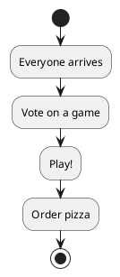

# Saturday Game Night 🎲

Six of us, one table, and Codenames requires teams — so here's how we're splitting up.

<table>
  <tr>
    <th>Team</th>
    <th colspan="2">Players</th>
    <th>Snack Duty</th>
  </tr>
  <tr>
    <td rowspan="2">Team Rocket</td>
    <td>Aiko (strategist)</td>
    <td>Ben (lucky charm, wins anyway)</td>
    <td rowspan="2">Chips &amp; salsa</td>
  </tr>
  <tr>
    <td>Cara (rules lawyer)</td>
    <td>Dai (here for the snacks)</td>
  </tr>
  <tr>
    <td>Team Chaos</td>
    <td colspan="2">Everyone else (no strategy, all vibes)</td>
    <td>Whatever's left</td>
  </tr>
</table>

Pizza math: with $p$ people, $s$ slices each, and a 20% buffer because Dave always eats like three people,

$$
\text{pies} = \left\lceil \frac{p \cdot s \cdot 1.2}{8} \right\rceil
$$

so 6 of us at 2 slices each means **2 pies** — plenty left over for seconds.

